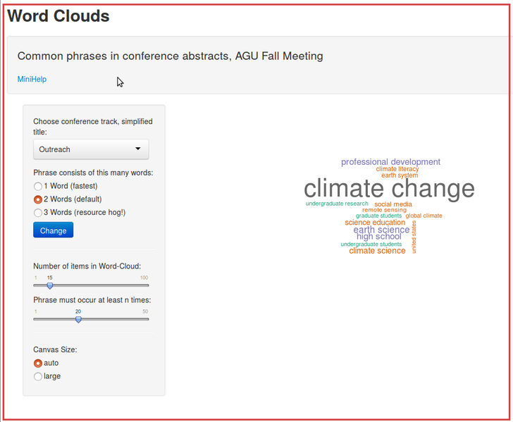

# wordcloud-01

This repo contains homework for an online course.

# Developing Data Products - R Course Project

This repo contains a [Shiny][5] app for the [Coursera course "Developing Data Products"][1].

The Shiny Web-App is hosted on [https://rapps.shinyapps.io/wordcloud01/][4].

There is also a _Slidify_ [presentation documenting and pitching the app][3].

Related [preprocessing scripts](https://github.com/knbknb/R_text_mining) sit in their own repository here on Github.

## Main Features

Just use the interactive features on the left menu of [my Shiny app](https://rapps.shinyapps.io/wordcloud01/).

Wait a bit (2 minutes) for the app to startup. (I have no control over the duration of loading process. I could use smaller corpora but that would make the app more boring).

### Preview

This is what the app should look like after startup:

### Assumptions

You have a modern browser, capable of processing HTML 5.

Best watched on a big monitor with a desktop PC. GUI layouting untested on mobile devices.

[1]: http://datasciencespecialization.github.io/ddp/
[2]: http://rpubs.com/thoughtfulbloke/25103
[3]: https://github.com/knbknb/wordcloud-01-pitch
[4]: https://rapps.shinyapps.io/wordcloud01/
[5]: http://shiny.rstudio.com/
